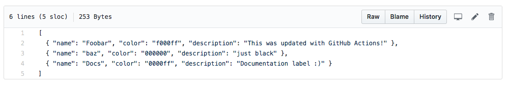
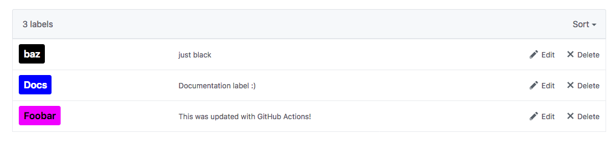

# Issue Label Manager Action

This GitHub Action allows you to declaratively state the labels to be defined in a repo.

In the repo you'd like to use this, define a JSON file in `.github/labels.json`. This file will contain an array of objects that have a name, color, and description as shown in the example below.



Then, set up a workflow that executes this action. When run, it will update the list of labels in the repo to match the JSON file. If you wish for this to remove any labels not in the JSON file, set the `delete` input to true as shown in the example below.

The result of using the labels.json file shown above is as follows:



If a label doesn't need a description, leave out the `description` field of the entry in the json file and when deployed the label will not contain a description.

## Usage

This action only needs the GITHUB_TOKEN secret as it interacts with the GitHub API to modify labels. The action can be used as such:

```yaml
on: issues
name: Create Default Labels
jobs:
  labels:
    name: DefaultLabelsActions
    runs-on: ubuntu-latest
    steps:
      - uses: actions/checkout@1.0.0
      - uses: lannonbr/issue-label-manager-action@3.0.0
        env:
          GITHUB_TOKEN: ${{ secrets.GITHUB_TOKEN }}
        with:
          delete: true # will delete any labels that aren't in the .github/labels.json (this is set to false by default)
```
